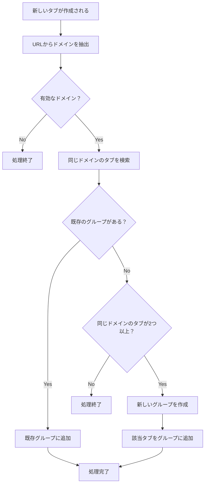

# 設計書

## 概要

Chrome拡張機能として、同じドメインのタブを自動的にグループ化する機能を実装します。Manifest V3を使用し、Service Workerでタブイベントを監視して、ドメインベースの自動グループ化を行います。

## アーキテクチャ

### 全体構成

```
Chrome拡張機能
├── manifest.json (設定ファイル)
├── background.js (Service Worker - メインロジック)
├── utils/
│   ├── domainUtils.js (ドメイン処理ユーティリティ)
│   └── groupUtils.js (グループ管理ユーティリティ)
└── constants.js (定数定義)
```

### 技術スタック

- **Manifest Version**: V3
- **Background Script**: Service Worker
- **APIs**: chrome.tabs, chrome.tabGroups
- **Language**: JavaScript (ES6+)

## コンポーネントとインターフェース

### 1. Background Service Worker (background.js)

メインのロジックを担当するService Worker。以下の責務を持ちます：

- タブイベントの監視
- グループ化ルールの評価と実行
- エラーハンドリング

**主要なイベントリスナー:**
- `chrome.tabs.onCreated`
- `chrome.tabs.onUpdated`
- `chrome.tabs.onMoved`

### 2. Domain Utilities (utils/domainUtils.js)

ドメイン関連の処理を担当するユーティリティモジュール。

**主要な関数:**
```javascript
// URLからドメインを抽出
extractDomain(url)

// 有効なドメインかチェック（chrome://等を除外）
isValidDomain(domain)

// 同じドメインのタブを検索
findTabsByDomain(domain, windowId)
```

### 3. Group Utilities (utils/groupUtils.js)

タブグループ関連の処理を担当するユーティリティモジュール。

**主要な関数:**
```javascript
// 自動生成されたグループかチェック
isAutoGeneratedGroup(groupId)

// ドメイン用のグループを検索
findGroupByDomain(domain, windowId)

// 新しいグループを作成
createGroupForDomain(domain, tabIds)

// タブをグループに追加
addTabToGroup(tabId, groupId)
```

### 4. Constants (constants.js)

アプリケーション全体で使用する定数を定義。

```javascript
// 自動生成グループの識別用プレフィックス
AUTO_GROUP_PREFIX = '[Auto]'

// 無視するURLパターン
IGNORED_URL_PATTERNS = ['chrome://', 'chrome-extension://', 'edge://', 'about:']

// グループ化の最小タブ数
MIN_TABS_FOR_GROUPING = 2
```

## データモデル

### Tab Information
```javascript
{
  id: number,
  url: string,
  domain: string,
  windowId: number,
  groupId: number | -1,
  isInUserGroup: boolean
}
```

### Group Information
```javascript
{
  id: number,
  title: string,
  color: string,
  windowId: number,
  isAutoGenerated: boolean,
  domain: string
}
```

## 処理フロー

### 1. タブ作成時の処理フロー



### 2. グループ判定ロジック

1. **ユーザー作成グループの判定**:
   - グループタイトルが`[Auto]`プレフィックスで始まらない
   - または、拡張機能が作成していないグループ

2. **自動グループ化の条件**:
   - 同じドメインのタブが2つ以上存在
   - 該当タブがユーザー作成グループに含まれていない
   - 有効なドメイン（chrome://等を除く）

## エラーハンドリング

### 1. API呼び出しエラー

```javascript
try {
  await chrome.tabs.group({tabIds: [tabId], groupId: groupId});
} catch (error) {
  console.error('Failed to add tab to group:', error);
  // エラーログを記録し、処理を継続
}
```

### 2. 権限エラー

- 必要な権限が不足している場合の適切なエラーメッセージ
- 機能の部分的な無効化

### 3. 無効なタブ/グループ参照

- 存在しないタブやグループへの参照時の安全な処理
- 状態の整合性チェック

## テスト戦略

### 1. 単体テスト

- **domainUtils.js**: ドメイン抽出とバリデーション
- **groupUtils.js**: グループ操作の各関数
- **background.js**: イベントハンドラーのロジック

### 2. 統合テスト

- タブ作成からグループ化までの完全なフロー
- 複数ウィンドウでの動作
- エラーケースでの動作

### 3. 手動テスト

- 実際のChromeブラウザでの動作確認
- 様々なWebサイトでのテスト
- ユーザー作成グループとの相互作用

## セキュリティ考慮事項

### 1. 権限の最小化

- 必要最小限のパーミッションのみを要求
- `tabs`と`tabGroups`のみを使用

### 2. データの取り扱い

- URLやドメイン情報の適切な処理
- 機密情報の外部送信なし

### 3. エラー情報の管理

- デバッグ情報の適切な制限
- ユーザー情報の漏洩防止

## パフォーマンス考慮事項

### 1. イベント処理の最適化

- 不要なAPI呼び出しの削減
- バッチ処理の活用

### 2. メモリ使用量

- 不要なデータの保持を避ける
- 適切なクリーンアップ処理

### 3. 応答性

- 非同期処理の適切な使用
- UIブロッキングの回避