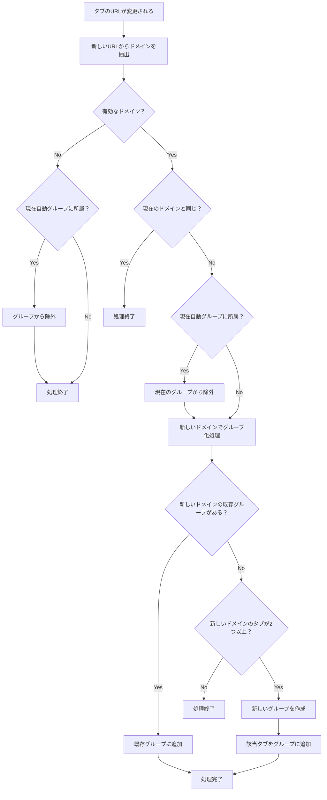
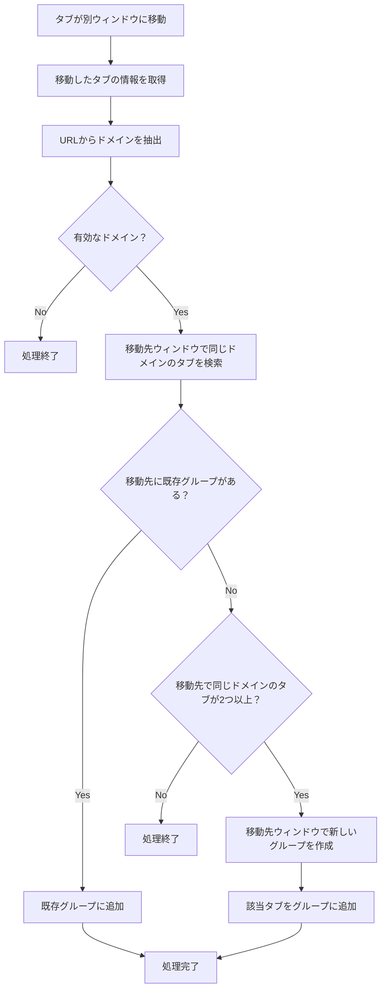

# 設計書

## 概要

Chrome拡張機能として、同じドメインのタブを自動的にグループ化する機能を実装します。Manifest V3を使用し、Service Workerでタブイベントを監視して、ドメインベースの自動グループ化を行います。

## アーキテクチャ

### 全体構成

```
Chrome拡張機能
├── manifest.json (設定ファイル)
├── src/
│   ├── background.ts (Service Worker - メインロジック)
│   ├── utils/
│   │   ├── domainUtils.ts (ドメイン処理ユーティリティ)
│   │   └── groupUtils.ts (グループ管理ユーティリティ)
│   ├── types/
│   │   └── index.ts (型定義)
│   ├── constants.ts (定数定義)
│   └── __tests__/ (テストファイル)
├── dist/ (tsgoによるビルド出力)
├── tsconfig.json (TypeScript設定)
├── vitest.config.ts (Vitest設定)
└── package.json (依存関係管理)
```

### 技術スタック

- **Manifest Version**: V3
- **Background Script**: Service Worker
- **APIs**: chrome.tabs, chrome.tabGroups
- **Language**: TypeScript
- **Build Tool**: tsgo（TypeScriptの直接実行・ビルド）
- **Test Framework**: Vitest
- **Package Manager**: pnpm

### ビルド環境

**tsgo**を使用することで、Webpackなどの複雑なバンドラー設定なしにTypeScriptを直接実行・ビルドできます：

#### tsgoの利点
- 設定ファイル不要でTypeScriptを直接実行
- Chrome拡張機能に適したシンプルなビルドプロセス
- 高速なコンパイルとホットリロード

#### ビルドコマンド例
```bash
# 開発時の直接実行
npx tsgo src/background.ts

# 本番用ビルド（dist/フォルダに出力）
npx tsgo build src/background.ts --outDir dist

# テスト実行
pnpm test
```

#### manifest.jsonでの参照
```json
{
  "background": {
    "service_worker": "dist/background.js"
  }
}
```

## コンポーネントとインターフェース

### 1. Background Service Worker (src/background.ts)

メインのロジックを担当するService Worker。以下の責務を持ちます：

- タブイベントの監視
- グループ化ルールの評価と実行
- エラーハンドリング

**主要なイベントリスナー:**
- `chrome.tabs.onCreated`
- `chrome.tabs.onUpdated`
- `chrome.tabs.onMoved`

### 2. Domain Utilities (src/utils/domainUtils.ts)

ドメイン関連の処理を担当するユーティリティモジュール。

**主要な関数:**
```typescript
// URLからドメインを抽出
extractDomain(url: string): string | null

// 有効なドメインかチェック（chrome://等を除外）
isValidDomain(domain: string): boolean

// 同じドメインのタブを検索
findTabsByDomain(domain: string, windowId: number): Promise<chrome.tabs.Tab[]>
```

### 3. Group Utilities (src/utils/groupUtils.ts)

タブグループ関連の処理を担当するユーティリティモジュール。

**主要な関数:**
```typescript
// 自動生成されたグループかチェック
isAutoGeneratedGroup(groupId: number): Promise<boolean>

// ドメイン用のグループを検索
findGroupByDomain(domain: string, windowId: number): Promise<chrome.tabGroups.TabGroup | null>

// 新しいグループを作成
createGroupForDomain(domain: string, tabIds: number[]): Promise<number>

// タブをグループに追加
addTabToGroup(tabId: number, groupId: number): Promise<void>
```

### 4. Type Definitions (src/types/index.ts)

TypeScript型定義を集約するモジュール。

```typescript
export interface TabInfo {
  id: number;
  url: string;
  domain: string;
  windowId: number;
  groupId: number;
  isInUserGroup: boolean;
}

export interface GroupInfo {
  id: number;
  title: string;
  color: chrome.tabGroups.ColorEnum;
  windowId: number;
  isAutoGenerated: boolean;
  domain: string;
}
```

### 5. Constants (src/constants.ts)

アプリケーション全体で使用する定数を定義。

```typescript
// 自動生成グループの識別用プレフィックス
export const AUTO_GROUP_PREFIX = '[Auto]' as const;

// 無視するURLパターン
export const IGNORED_URL_PATTERNS = [
  'chrome://',
  'chrome-extension://',
  'edge://',
  'about:'
] as const;

// グループ化の最小タブ数
export const MIN_TABS_FOR_GROUPING = 2 as const;
```

## データモデル

### Tab Information
```typescript
interface TabInfo {
  id: number;
  url: string;
  domain: string;
  windowId: number;
  groupId: number;
  isInUserGroup: boolean;
}
```

### Group Information
```typescript
interface GroupInfo {
  id: number;
  title: string;
  color: chrome.tabGroups.ColorEnum;
  windowId: number;
  isAutoGenerated: boolean;
  domain: string;
}
```

## 処理フロー

### 1. タブ作成時の処理フロー


### 2. タブ更新時（URL変更）の処理フロー



### 3. タブ移動時（ウィンドウ間移動）の処理フロー



### 2. グループ判定ロジック

1. **ユーザー作成グループの判定**:
   - グループタイトルが`[Auto]`プレフィックスで始まらない
   - または、拡張機能が作成していないグループ

2. **自動グループ化の条件**:
   - 同じドメインのタブが2つ以上存在
   - 該当タブがユーザー作成グループに含まれていない
   - 有効なドメイン（chrome://等を除く）

## エラーハンドリング

### 1. API呼び出しエラー

```typescript
try {
  await chrome.tabs.group({tabIds: [tabId], groupId: groupId});
} catch (error: unknown) {
  console.error('Failed to add tab to group:', error);
  // エラーログを記録し、処理を継続
}
```

### 2. 権限エラー

- 必要な権限が不足している場合の適切なエラーメッセージ
- 機能の部分的な無効化

### 3. 無効なタブ/グループ参照

- 存在しないタブやグループへの参照時の安全な処理
- 状態の整合性チェック

## テスト戦略（TDD準拠）

### 1. テスト駆動開発（TDD）アプローチ

t-wadaの推奨するTDDサイクルに従い、以下の手順で開発を進めます：

1. **Red**: 失敗するテストを書く
2. **Green**: テストを通す最小限のコードを書く
3. **Refactor**: コードを改善する

### 2. テスト構成

#### 2.1 単体テスト（Vitest + @types/chrome）

**domainUtils.ts**:
```typescript
describe('extractDomain', () => {
  test('should extract domain from valid URL', () => {
    expect(extractDomain('https://example.com/path')).toBe('example.com');
  });
  
  test('should return null for invalid URL', () => {
    expect(extractDomain('invalid-url')).toBeNull();
  });
});

describe('isValidDomain', () => {
  test('should return true for valid domain', () => {
    expect(isValidDomain('example.com')).toBe(true);
  });
  
  test('should return false for chrome:// URLs', () => {
    expect(isValidDomain('chrome')).toBe(false);
  });
});
```

**groupUtils.ts**:
```typescript
describe('isAutoGeneratedGroup', () => {
  test('should identify auto-generated group by title prefix', async () => {
    // モックを使用してChrome APIをテスト
    const mockGroup = { title: '[Auto] example.com' };
    chrome.tabGroups.get = vi.fn().mockResolvedValue(mockGroup);
    
    const result = await isAutoGeneratedGroup(1);
    expect(result).toBe(true);
  });
});
```

#### 2.2 統合テスト

**background.ts**:
```typescript
describe('Tab grouping integration', () => {
  test('should create new group when 2+ tabs of same domain exist', async () => {
    // Chrome API のモック設定
    // タブ作成イベントのシミュレーション
    // グループ作成の検証
  });
  
  test('should add tab to existing group', async () => {
    // 既存グループがある状態でのテスト
  });
});
```

### 3. テスト環境設定

#### 3.1 依存関係
```json
{
  "devDependencies": {
    "@types/chrome": "^0.0.246",
    "vitest": "^1.0.0",
    "vite": "^5.0.0",
    "@vitest/ui": "^1.0.0"
  }
}
```

#### 3.2 Vitest設定（vitest.config.ts）
```typescript
import { defineConfig } from 'vitest/config';

export default defineConfig({
  test: {
    environment: 'jsdom',
    setupFiles: ['src/test/setup.ts'],
    include: ['src/**/*.test.ts'],
    coverage: {
      include: ['src/**/*.ts'],
      exclude: ['src/**/*.d.ts', 'src/test/**'],
    },
  },
});
```

### 4. モック戦略

#### 4.1 Chrome API モック
```typescript
// src/test/setup.ts
import { vi } from 'vitest';

global.chrome = {
  tabs: {
    onCreated: { addListener: vi.fn() },
    onUpdated: { addListener: vi.fn() },
    query: vi.fn(),
    group: vi.fn(),
  },
  tabGroups: {
    get: vi.fn(),
    create: vi.fn(),
    query: vi.fn(),
  },
} as any;
```

### 5. TDD実装順序

1. **ドメインユーティリティ**: 最も基本的な機能から開始
2. **グループユーティリティ**: ドメイン機能に依存する機能
3. **イベントハンドラー**: 統合的な機能
4. **エラーハンドリング**: 各段階でのエラーケース

### 6. カバレッジ目標

- **単体テスト**: 90%以上のコードカバレッジ
- **統合テスト**: 主要なユーザーシナリオの100%カバー
- **エッジケース**: エラーハンドリングの完全なテスト

## セキュリティ考慮事項

### 1. 権限の最小化

- 必要最小限のパーミッションのみを要求
- `tabs`と`tabGroups`のみを使用

### 2. データの取り扱い

- URLやドメイン情報の適切な処理
- 機密情報の外部送信なし

### 3. エラー情報の管理

- デバッグ情報の適切な制限
- ユーザー情報の漏洩防止

## パフォーマンス考慮事項

### 1. イベント処理の最適化

- 不要なAPI呼び出しの削減
- バッチ処理の活用

### 2. メモリ使用量

- 不要なデータの保持を避ける
- 適切なクリーンアップ処理

### 3. 応答性

- 非同期処理の適切な使用
- UIブロッキングの回避