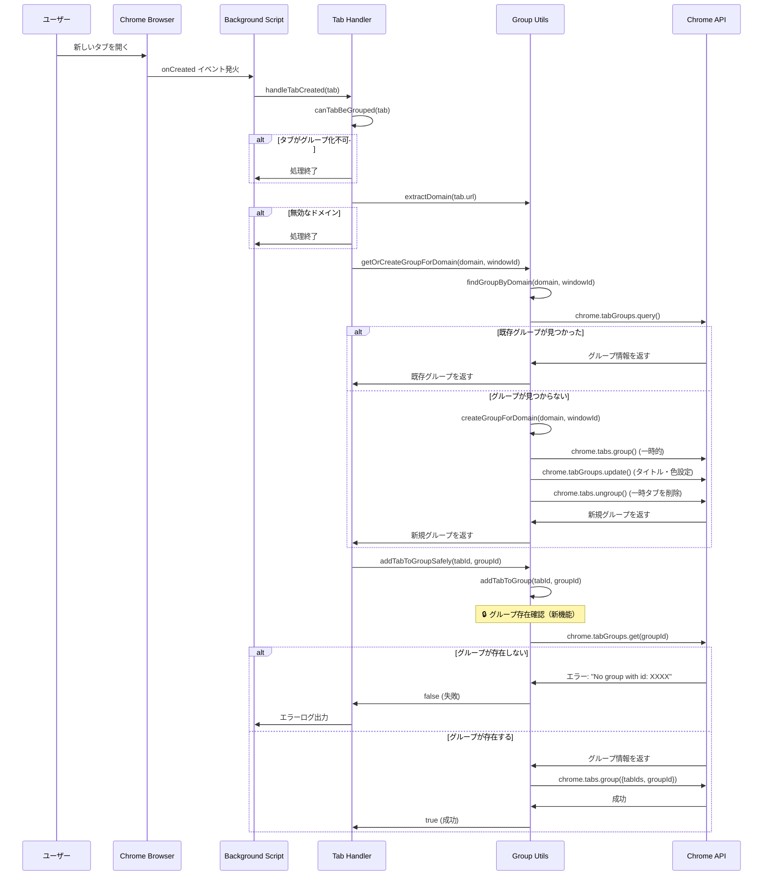
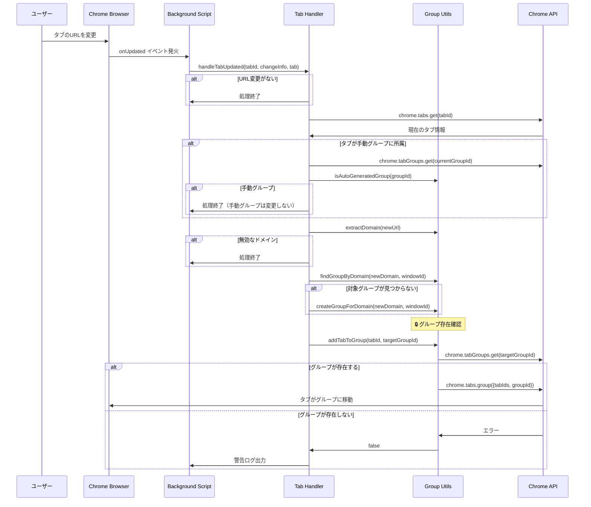
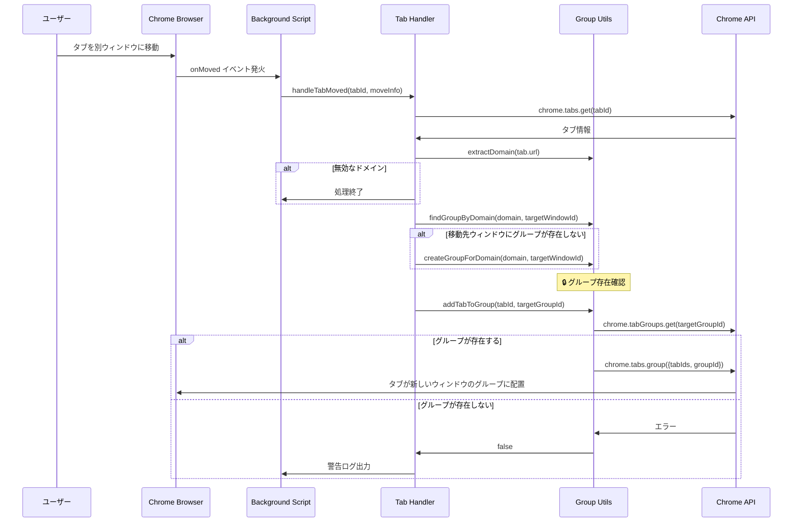
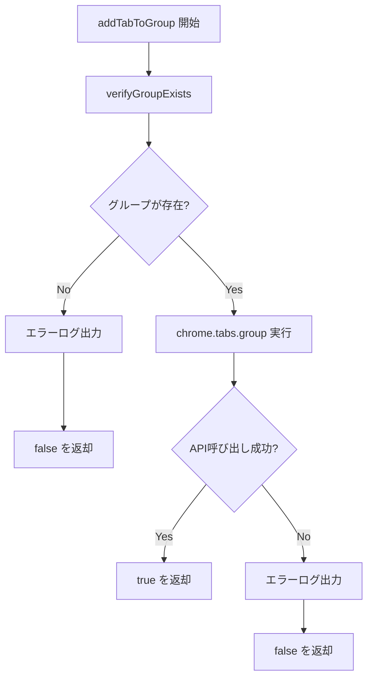

# Chrome Tab Auto Grouping - 処理フロー

このドキュメントは、Chrome Tab Auto Grouping拡張機能の修正後の処理フローを詳細に説明します。

## 概要

この拡張機能は、Webサイトのドメインに基づいてタブを自動的にグループ化します。主要な改善点として、**グループ存在確認機能**を追加し、「No group with id: XXXX」エラーを防止しています。

## 主要コンポーネント

### 1. イベントハンドラー
- **Tab Created**: 新しいタブが作成された時の処理
- **Tab Updated**: タブのURL変更時の処理  
- **Tab Moved**: タブがウィンドウ間で移動した時の処理

### 2. グループ管理ユーティリティ
- **Group Verification**: グループの存在確認（新機能）
- **Group Finding**: ドメイン別グループの検索
- **Group Creation**: 新規グループの作成
- **Tab Assignment**: タブのグループ割り当て

## 処理フロー

### タブ作成時のフロー



### タブ更新時のフロー



### タブ移動時のフロー



## エラーハンドリング

### 修正前の問題
- グループの存在確認を行わずに `chrome.tabs.group()` を実行
- 削除されたグループIDに対してタブ追加を試行
- 結果として「No group with id: XXXX」エラーが発生

### 修正後の改善
1. **事前グループ検証**: `verifyGroupExists()` 関数でグループの存在を確認
2. **安全な処理**: 存在しないグループの場合は処理をスキップ
3. **適切なログ**: エラー状況を明確に記録

### エラーケースの処理



## 主要な改善点

### 1. グループ存在確認機能
```typescript
async function verifyGroupExists(groupId: number): Promise<boolean> {
  try {
    await chrome.tabGroups.get(groupId);
    return true;
  } catch (error) {
    console.warn(`Group with id ${groupId} does not exist:`, error);
    return false;
  }
}
```

### 2. 安全なタブ追加
```typescript
export async function addTabToGroup(tabIds: number | number[], groupId: number): Promise<boolean> {
  try {
    // グループの存在を事前に確認
    const groupExists = await verifyGroupExists(groupId);
    if (!groupExists) {
      console.error(`Cannot add tab to group: Group with id ${groupId} does not exist`);
      return false;
    }

    const tabIdArray = Array.isArray(tabIds) ? tabIds : [tabIds];
    
    await chrome.tabs.group({
      tabIds: tabIdArray,
      groupId
    });
    
    return true;
  } catch (error) {
    console.error('Error adding tab to group:', error);
    return false;
  }
}
```

## パフォーマンス考慮事項

1. **最小限のAPI呼び出し**: グループ存在確認は軽量な `chrome.tabGroups.get()` を使用
2. **早期リターン**: 無効な状態での処理を早期に終了
3. **エラー時の適切な処理**: 失敗時に再試行ループを避ける

## 今後の改善検討項目

1. **キャッシュ機能**: グループ情報のキャッシュでAPI呼び出し数を削減
2. **再試行メカニズム**: 一時的なAPI障害時の自動再試行
3. **ユーザー通知**: グループ作成失敗時のユーザー向け通知機能
4. **設定可能なルール**: ドメイン除外やカスタムグループ名の設定機能